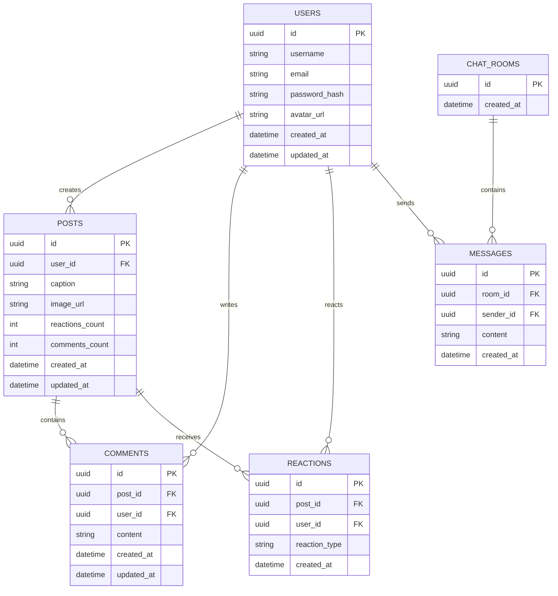

# CatHub ERD

## Overview

CatHub is a social platform for cat lovers.

Users can:

- Create an account
- Upload and share cat photos
- React to posts
- Comment on posts
- Chat with other users in real time

---

# Entity Relationship Diagram



---

# Relationships

## User → Posts

A user can create multiple posts.

```text
User (1) -------- (*) Posts
```

---

## User → Comments

A user can write multiple comments.

```text
User (1) -------- (*) Comments
```

---

## User → Reactions

A user can react to multiple posts.

```text
User (1) -------- (*) Reactions
```

---

## Post → Comments

A post can contain multiple comments.

```text
Post (1) -------- (*) Comments
```

---

## Post → Reactions

A post can receive multiple reactions.

```text
Post (1) -------- (*) Reactions
```

---

## ChatRoom → Messages

A chat room can contain multiple messages.

```text
ChatRoom (1) -------- (*) Messages
```

---

## User → Messages

A user can send multiple messages.

```text
User (1) -------- (*) Messages
```

---

# Future Enhancements

The following entities are planned for future releases:

- FOLLOWS
- NOTIFICATIONS
- FILES
- POST_TAGS
- REPORTS
- BLOCKED_USERS
- REFRESH_TOKENS

These tables are intentionally excluded from the initial version to keep the system simple and focused on the core features.

---

# Database

Current database engine:

```text
PostgreSQL
```

Future integrations:

```text
Redis     -> Caching
AWS S3    -> Image Storage
AWS SQS   -> Background Messaging
AWS Lambda -> Image Processing
```